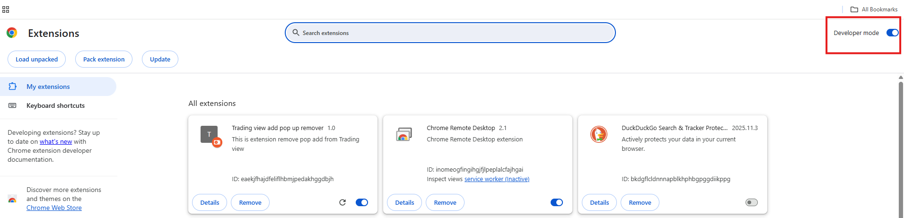
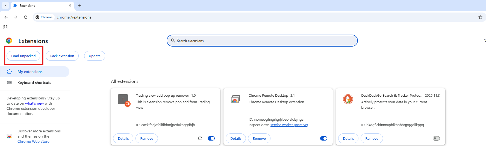

## How to Add Extension
#### I am using chrome broswer, you can also use this in other broswer, same setting will be their , but some ui changes

## 1. Open Follwing url
```url
chrome://extensions```

## 2. Enable Developer Option (On Top Right Corner)




## 3. Downlaod All Github Files and save it one Folder

## 4. Now click on Load unpacked (On Top Left Corner)




## 5. Now select that Folder where you save Extension Files , which you download on step 3


### That's it

